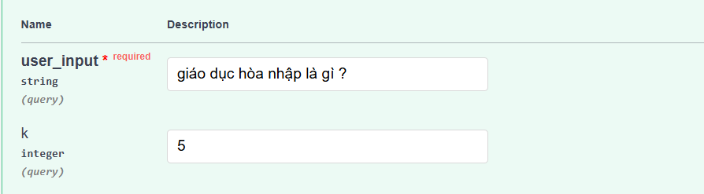
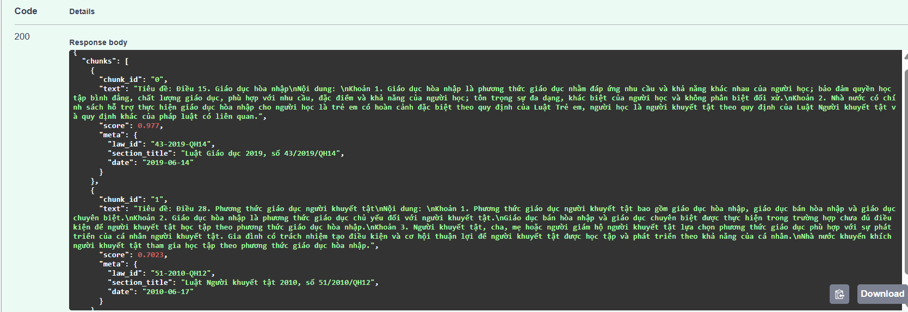
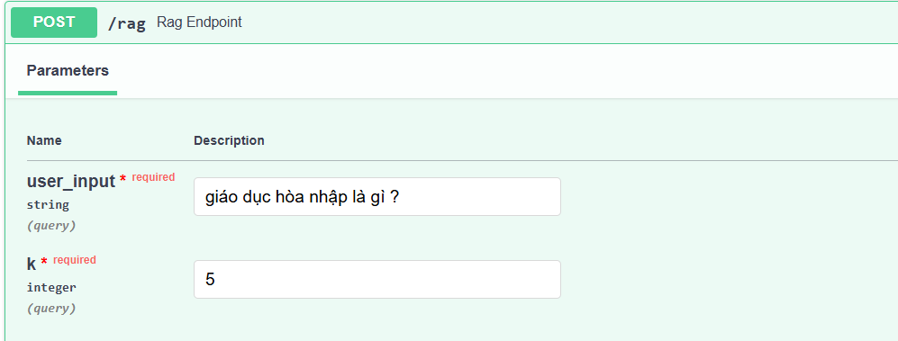
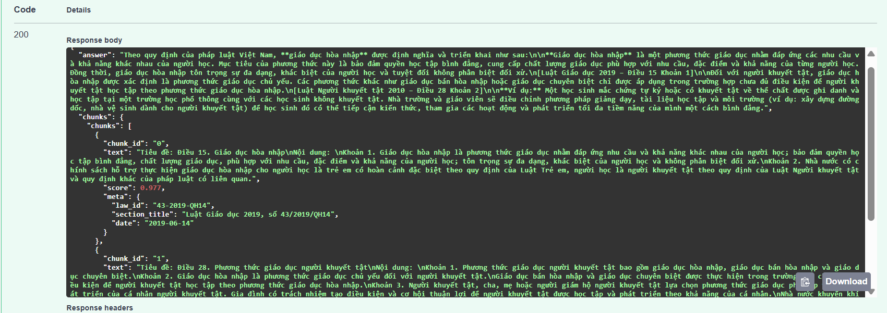
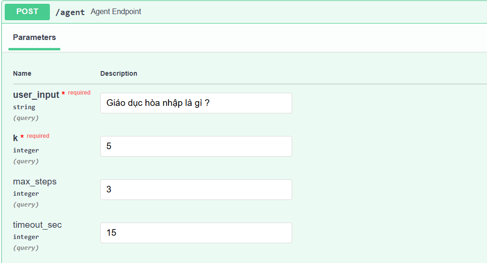
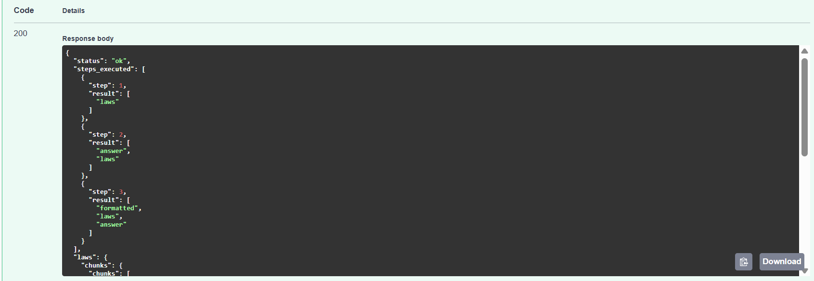
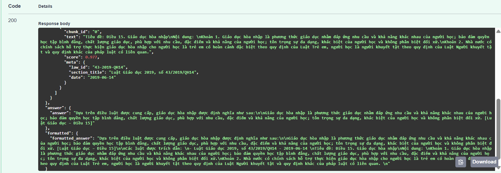

# Manual Test Results

## 1. Kiểm thử API `/retrieve`

* **Input**: `user_input="giáo dục hòa nhập là gì ?", k=5`
* **Kết quả**: Hệ thống trả về các `chunks` liên quan, có nội dung đúng theo luật (Luật Giáo dục 2019, Luật Người khuyết tật 2010).
* **Nhận xét**: API hoạt động đúng, trả về thông tin chính xác, có điểm `score` và metadata kèm theo.

---

## 2. Kiểm thử API `/rag-query`

* **Input**: `user_input="giáo dục hòa nhập là gì ?", k=5`
* **Kết quả**: Trả về một câu trả lời tự nhiên (natural language answer), kèm theo các `chunks` nguồn.
* **Nhận xét**: Đáp án được tóm gọn dễ hiểu, có trích dẫn luật, ví dụ minh họa. Đúng mong đợi.

---

## 3. Kiểm thử API `/agent`

* **Input**: `user_input="giáo dục hòa nhập là gì ?", k=5, max_steps=3, timeout_sec=15`
* **Kết quả**: Agent thực hiện 3 bước (`laws → answer → formatted`). Trả về answer đã được định dạng, kèm theo trích dẫn luật.
* **Nhận xét**: Agent orchestration hoạt động tốt, các bước tuần tự rõ ràng, kết quả cuối cùng đầy đủ và dễ đọc.

---

## Tổng kết

* Cả 3 API (`/retrieve`, `/rag-query`, `/agent`) đều hoạt động đúng mong đợi.
* Response có cấu trúc rõ ràng, thông tin đầy đủ, dễ kiểm chứng.
* Swagger UI hỗ trợ test nhanh, thao tác thuận tiện.

---
